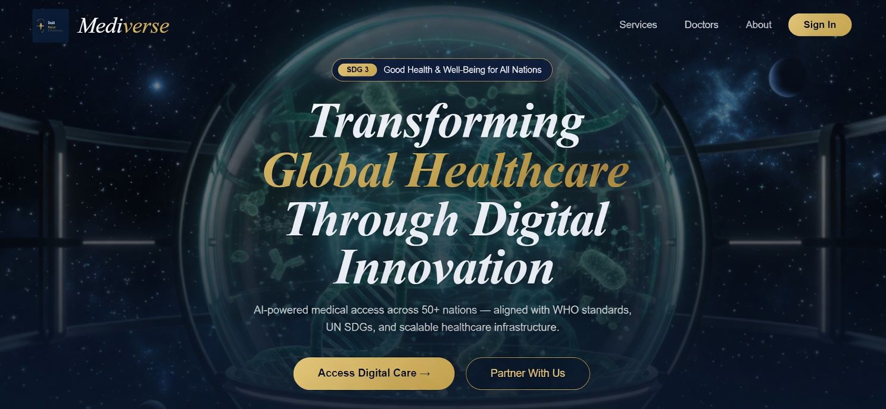
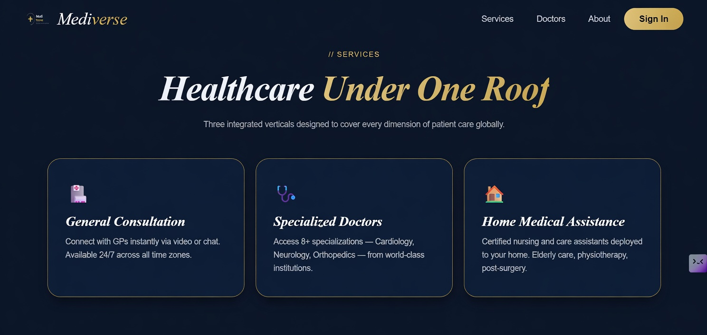
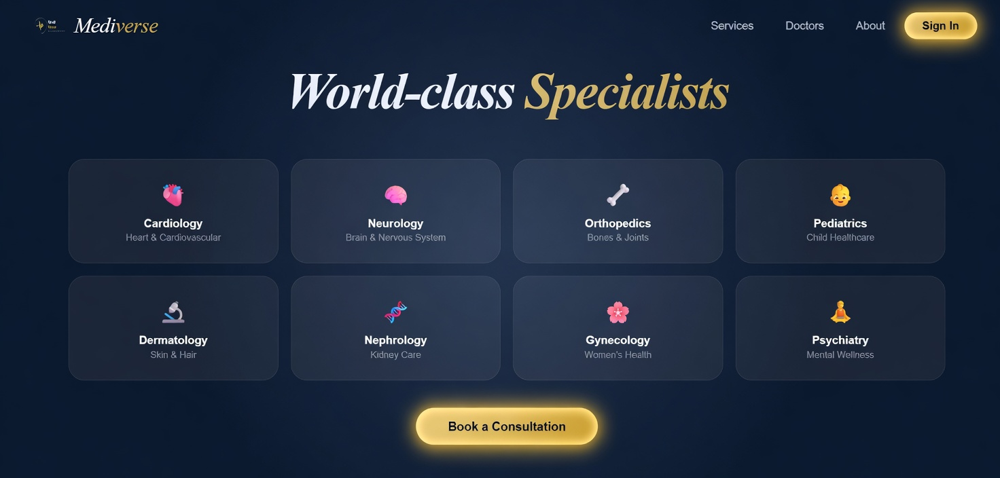
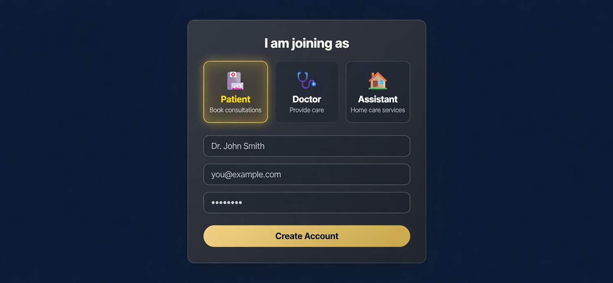

<div align="center">



<br><br>

# MediVerse — ClinicOnline
### Transforming Global Healthcare Through Digital Innovation

**AI-powered medical access across 50+ nations — aligned with WHO standards, UN SDGs, and scalable healthcare infrastructure**

[](https://mediverse-eta.vercel.app)
[](https://sdgs.un.org/goals/goal3)


</div>

---

## 🎯 The Problem

**1 billion people** globally have no access to essential healthcare services (WHO, 2023).

- Pakistan has 1 doctor per 1,000 patients — WHO recommends 1 per 500
- Rural patients travel 3–5 hours to reach a specialist
- 8+ specializations unavailable outside major cities
- Home care for elderly and post-surgery patients is unorganized and unverified
- No unified digital platform connects patients, doctors, and home assistants

---

## 💡 The Solution

MediVerse is a global digital healthcare platform connecting patients with verified specialists through online consultations, and deploying certified assistants for home medical care — all under one roof.

> Aligned with **UN SDG 3** (Good Health & Well-Being) and **WHO Universal Health Coverage** standards.

---

## ✨ Features

### 🏥 Three Integrated Service Verticals

**General Consultation**
Connect with GPs instantly via video or chat. Available 24/7 across all time zones.

**Specialized Doctors**
Access 8+ specializations — Cardiology, Neurology, Orthopedics — from world-class institutions.

**Home Medical Assistance**
Certified nursing and care assistants deployed to your home. Elderly care, physiotherapy, post-surgery recovery.

### 👤 Three-Role Authentication System
Role-based signup and dashboards for **Patients**, **Doctors**, and **Assistants** — each with tailored workflows and permissions.

### 🌍 8 Medical Specializations

| Specialization | Focus |
|---|---|
| Cardiology | Heart & Cardiovascular |
| Neurology | Brain & Nervous System |
| Orthopedics | Bones & Joints |
| Pediatrics | Child Healthcare |
| Dermatology | Skin & Hair |
| Nephrology | Kidney Care |
| Gynecology | Women's Health |
| Psychiatry | Mental Wellness |

### 🔐 Secure Authentication
Multi-role account creation with email verification, secure session management, and role-based access control.

---

## 🖼️ Screenshots

<div align="center">

**Hero — Global Healthcare Platform**


**Services — Healthcare Under One Roof**


**World-Class Specialists**


**Role-Based Signup**


</div>

---

## 🛠️ Tech Stack

| Layer | Technology |
|---|---|
| **Framework** | Next.js 15 (App Router) |
| **Language** | TypeScript |
| **UI** | React + Tailwind CSS |
| **Auth** | NextAuth.js |
| **Deployment** | Vercel |
| **Design** | Figma — dark theme, gold accent |

---

## 🚀 Quick Start

```bash
# 1. Clone
git clone https://github.com/Mujahidaryan/mediverse-cliniconline.git
cd mediverse-cliniconline

# 2. Install
npm install

# 3. Configure environment
cp .env.example .env.local
# Add your NEXTAUTH_SECRET and DATABASE_URL

# 4. Run
npm run dev
# Open http://localhost:3000
```

### Environment Variables

| Variable | Required | Description |
|---|---|---|
| `NEXTAUTH_SECRET` | ✅ Yes | Random secret for session encryption |
| `NEXTAUTH_URL` | ✅ Yes | Your deployment URL |
| `DATABASE_URL` | ✅ Yes | PostgreSQL connection string |

---

## ☁️ Deploy on Vercel

1. Push to GitHub
2. Go to [vercel.com/new](https://vercel.com/new) → Import repo
3. Add environment variables in Vercel Dashboard
4. Click **Deploy** — live in ~60 seconds

---

## 🌍 SDG Alignment

| Goal | How MediVerse contributes |
|---|---|
| **SDG 3** — Good Health & Well-Being | Direct — digital healthcare access for underserved populations |
| **SDG 10** — Reduced Inequalities | Removing geographic and financial barriers to specialist care |
| **SDG 9** — Industry & Innovation | Digital infrastructure for healthcare delivery at scale |
| **SDG 17** — Partnerships | Platform model enabling doctor, patient, and assistant networks |

---

## 👤 Author

**Muhammad Mujahid** — Full Stack Developer, Karachi, Pakistan

[](https://linkedin.com/in/muhammad-mujahid-dev)
[](https://github.com/Mujahidaryan)
[](https://my-portfolio-swart-nu-73.vercel.app)
[](mailto:mujahidaryan222149@gmail.com)

---

## 📄 License

MIT © 2026 Muhammad Mujahid

---

<div align="center">
  <sub>Aligned with UN SDG 3 — Good Health & Well-Being for All Nations.</sub>
</div>
